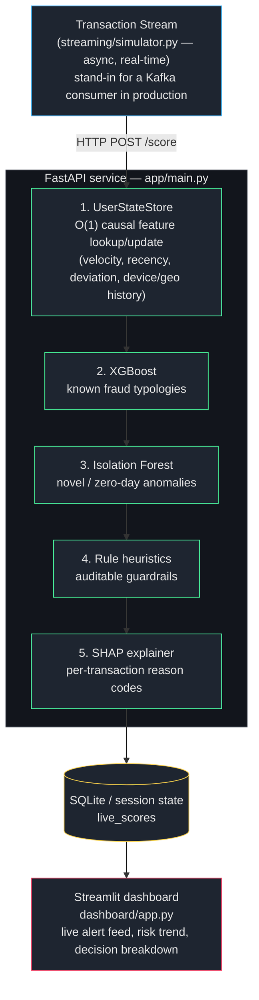
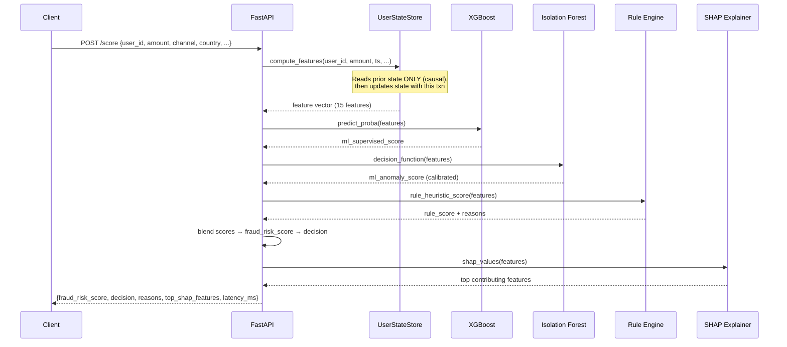
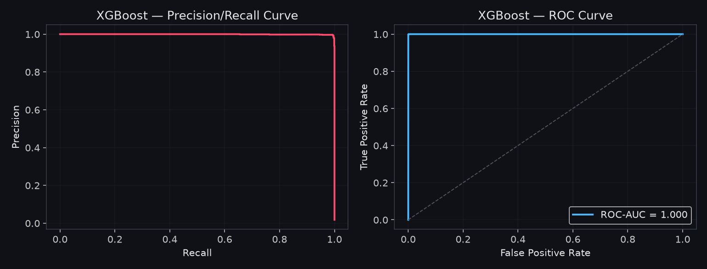
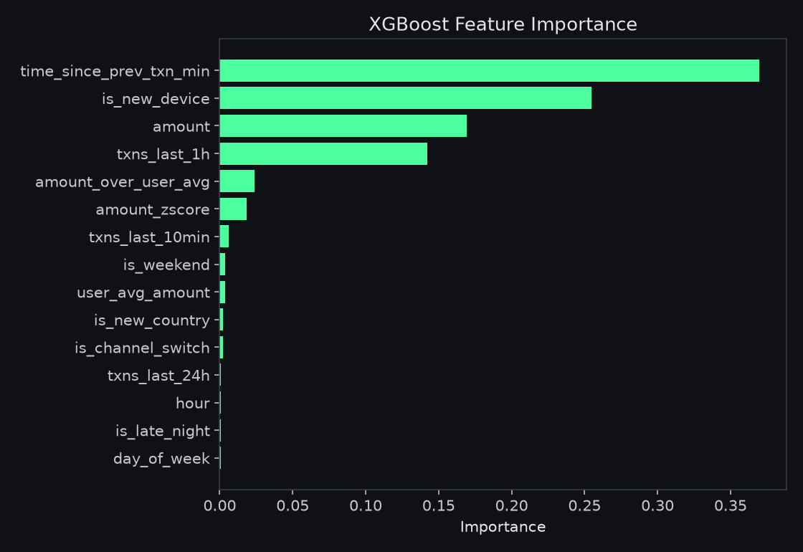
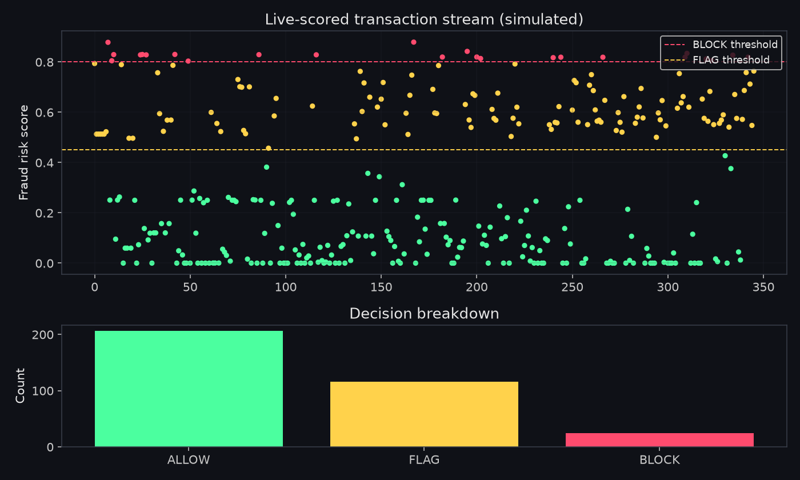

# 🚨 Real-Time Fraud & Anomaly Detection System

[](https://github.com/NishchayAzad/Real-Time-Fraud-Detection-Anomaly-Intelligence-Platform/actions/workflows/ci.yml)


A hybrid **supervised + unsupervised** fraud scoring engine, served in real time via FastAPI,
with stateful causal feature engineering, SHAP explainability, and a live monitoring dashboard.

Built on a **self-generated, multi-channel synthetic transaction dataset** — every column and
every fraud pattern is something I designed and can explain, rather than an anonymized
Kaggle CSV with columns like `V1...V28`.

**🔴 Live demo:** _[API](#) · [Dashboard](#)_ — see [Deploying it live](#deploying-it-live) below
to stand these up yourself for free in ~10 minutes.

---

## Why this project is different from a typical "fraud detection" portfolio project

Most fraud detection projects on GitHub are a single classifier (usually XGBoost or a random
forest) trained on a public Kaggle dataset, evaluated offline with a precision/recall table.
That's a modeling exercise, not a fraud **system**. This project is built around the three
things that actually separate a real fraud engine from a notebook:

| Gap in typical projects | What this project does instead |
|---|---|
| Anonymized dataset (`V1..V28`) you can't explain | Self-written synthetic data generator with 4 named fraud typologies you can describe end-to-end |
| One supervised model, blind to novel fraud | **Hybrid** supervised (XGBoost) + unsupervised (Isolation Forest) scoring — the second model exists specifically to catch fraud patterns that don't resemble any label |
| Features computed by scanning a CSV/DB at request time (leaks the future, too slow) | **Causal, O(1) stateful feature engineering** — every feature uses only what happened *before* the current transaction, computed with the exact same code path offline (training) and online (serving) |
| "Here's my F1 score" and nothing else | A hybrid **rule + ML risk engine** with human-readable reason codes and per-transaction **SHAP** explanations — the auditability a real fraud/compliance team needs |
| A trained model in a notebook, no serving story | A running **FastAPI** service, an **async streaming simulator**, and a **live Streamlit dashboard** — the full loop from transaction to alert |

---

## Architecture



### Request lifecycle (what happens on every `/score` call)



---

## Results (real output from this project's own code)

<p align="center">
  
</p>

| Model | PR-AUC | ROC-AUC |
|---|---|---|
| XGBoost (supervised) | 0.999 | 1.000 |
| Isolation Forest (unsupervised, as anomaly ranker) | 0.881 | — |

The supervised model performs near-perfectly *on the fraud patterns it was trained on* —
expected, since the synthetic typologies have a clear behavioral signature. The honest
interview talking point is the isolation forest number: it recovers ~88% of fraud **using
no labels at all**, which is the actual point of the hybrid design — it's the layer that
would still catch a fifth, never-labeled fraud typology that XGBoost has never seen.

<p align="center">
  
</p>

`time_since_prev_txn_min` and `is_new_device` dominate — which lines up exactly with the
two fraud typologies built for rapid detection (card testing = near-zero time between
transactions, account takeover = a brand-new device). That kind of alignment between what
the model actually learned and the typologies it was trained on is the thing to point out
in an interview.

<p align="center">
  
</p>

A simulated live stream, scored transaction-by-transaction through the real pipeline: normal
traffic clusters near zero risk, fraud bursts climb from FLAG into BLOCK as the system
accumulates evidence (velocity, new device, anomalous amount) within the burst — this
escalation behavior, not just a final score, is what the stateful design buys you.

*(Regenerate these from scratch anytime with `python docs/generate_readme_charts.py` — every
number in them comes from actually running this project's code, not a mockup.)*

---

## The dataset (`data/generate_dataset.py`)

I generate a synthetic, multi-channel transaction dataset rather than using a pre-existing
one, so I can explain every field and design decision:

- **Channels**: `CARD_PRESENT`, `CARD_NOT_PRESENT`, `UPI_WALLET`, `WIRE_TRANSFER` — each has
  a different "normal" profile (amount distribution, preferred channel per user).
- **4,000 synthetic users**, each with a home country, average transaction size, preferred
  channel, and account age — so "normal" is defined per-user, not globally.
- **Four injected fraud typologies**, each with a distinct behavioral signature:
  - `CARD_TESTING` — 6–15 tiny transactions in rapid succession on a new device (fraudsters
    validating a stolen card before a large purchase).
  - `ACCOUNT_TAKEOVER` — a burst of large transactions from a new device *and* a foreign
    country inconsistent with the user's history.
  - `MULE_FANOUT` — one large incoming wire transfer immediately followed by several
    smaller outgoing transfers to previously-unseen beneficiaries.
  - `MERCHANT_COLLUSION` — repeated, suspiciously round-number charges to the same merchant.

```bash
python data/generate_dataset.py --n-users 4000 --n-transactions 260000 --fraud-rate 0.012
```

## Causal feature engineering (`src/features.py`)

The single most important design decision in this project: **the same `UserStateStore`
class is used both offline (replaying history during training) and online (serving live
requests)**. Every feature is computed using only transactions that happened *before* the
current one for that user — no future leakage, and no offline/online feature mismatch,
which is one of the most common real-world bugs in fraud systems.

Features (all O(1) or O(k) with small bounded k):
`amount`, `hour`, `day_of_week`, `is_weekend`, `is_late_night`, `time_since_prev_txn_min`,
`txns_last_10min`, `txns_last_1h`, `txns_last_24h`, `user_avg_amount`,
`amount_over_user_avg`, `amount_zscore`, `is_new_device`, `is_new_country`,
`is_channel_switch`.

## Hybrid risk engine (`src/risk_engine.py`)

```
final_risk = 0.55 × XGBoost_probability   (known fraud patterns)
           + 0.25 × IsolationForest_score (novel/anomalous patterns, calibrated
                                            against the actual legit-data score
                                            distribution — see calibration note below)
           + 0.20 × rule_heuristic_score  (auditable guardrails)
```

Decision thresholds: `≥0.80 → BLOCK`, `≥0.45 → FLAG`, else `ALLOW`. Every decision comes
with plain-English reasons (e.g. *"New device AND new country observed simultaneously"*)
plus the top SHAP-contributing features for the ML component.

> **A calibration bug I found and fixed while building this:** the anomaly score was
> originally normalized with an assumed fixed center, which saturated near 1.0 for almost
> *any* transaction — not just genuine anomalies. It didn't visibly break decisions (its
> 0.25 weight alone couldn't cross the FLAG threshold on its own), but it meant that signal
> was effectively noise. The fix: `train.py` now computes the actual p50/p99 of the
> Isolation Forest's `decision_function` on legit training data and saves it as
> `models/anomaly_calibration.json`; `risk_engine.py` maps new scores against that real
> distribution instead of a guess. Worth knowing this story for an interview — it's a good
> example of the gap between "the code runs" and "the numbers are actually meaningful."

## Results (on the generated dataset, holdout split)

The supervised model performs near-perfectly *on the fraud patterns it was trained on* —
expected, since the synthetic typologies have a clear behavioral signature. The honest
interview talking point is the isolation forest number: it recovers ~88% of fraud **using
no labels at all**, which is the actual point of the hybrid design — it's the layer that
would still catch a fifth, never-labeled fraud typology that XGBoost has never seen.

---

## Running it end to end

```bash
pip install -r requirements.txt

# 1. Generate data + train both models
python data/generate_dataset.py
python src/train.py

# 2. Start the real-time scoring API
uvicorn app.main:app --reload --port 8000
# docs at http://127.0.0.1:8000/docs

# 3. In another terminal, watch the live dashboard (self-contained --
#    it generates its own demo traffic, no separate simulator process needed)
streamlit run dashboard/app.py
# click "Start" in the sidebar

# (optional) run the standalone streaming simulator instead, which writes to
# a local SQLite file the dashboard will auto-detect and read from:
python streaming/simulator.py --api http://127.0.0.1:8000 --rate 5 --duration 300
```

Or with Docker (API only):
```bash
docker compose up --build
```

### Example request

```bash
curl -X POST http://127.0.0.1:8000/score -H "Content-Type: application/json" -d '{
  "user_id": "U100042", "amount": 1500, "channel": "UPI_WALLET",
  "country": "IN", "merchant_id": "M4821", "device_id": "D1234"
}'
```

```json
{
  "transaction_id": "REQ-8e3fa49174",
  "fraud_risk_score": 0.83,
  "decision": "BLOCK",
  "ml_supervised_score": 1.0,
  "ml_anomaly_score": 0.91,
  "rule_heuristic_score": 0.35,
  "reasons": [
    "Very high transaction velocity (5+ in last 10 minutes)",
    "ML model strongly matches a known fraud pattern (p=1.00)",
    "Transaction is statistically anomalous vs. population (score=0.91)"
  ],
  "top_shap_features": [
    {"feature": "txns_last_10min", "value": 6, "shap_contribution": 3.21}
  ],
  "latency_ms": 4.2
}
```

---

## Deploying it live

You can put a working, publicly-reachable version of this online for free in about ten
minutes — genuinely useful for a resume link, not just local instructions.

**1. Deploy the API on [Render](https://render.com) (free tier, Docker-based):**
1. Sign in to Render with your GitHub account.
2. **New +** → **Web Service** → connect this repository.
3. Render will detect the `Dockerfile` automatically — leave build/start commands blank.
4. Instance type: **Free**. Click **Create Web Service**.
5. Wait for the build (~3–5 min). You'll get a URL like `https://your-app.onrender.com`.
6. Verify: `curl https://your-app.onrender.com/health`

   *Free tier note: the service sleeps after inactivity and takes ~30–60s to wake on the
   first request — mention this if a reviewer tries it cold.*

2. **Deploy the dashboard on [Streamlit Community Cloud](https://streamlit.io/cloud) (free):**
1. Sign in with GitHub → **New app** → select this repo, branch `main`, file
   `dashboard/app.py`.
2. **Before clicking Deploy**, expand **"Advanced settings"** and set **Python version to
   3.12**. This step matters:

   > `runtime.txt` is unreliable on Streamlit Community Cloud (confirmed by multiple open
   > issues in their own repo — it's frequently ignored in favor of whatever the platform's
   > current default is, e.g. Python 3.13). This project pins `numpy<2` (required for `shap`
   > compatibility — see the calibration note above), which doesn't ship wheels for Python
   > 3.13, so the version must be selected explicitly at deploy time. If you already deployed
   > without setting this, delete the app and redeploy — Python version can't be changed on
   > an existing deployment.
3. Under **Advanced settings → Secrets**, nothing is required, but you can optionally set
   `FRAUD_API_URL = "https://your-app.onrender.com"` as an environment variable so the
   dashboard defaults to your deployed API instead of `localhost`.
4. Deploy. In the running app's sidebar, confirm/paste your Render URL into
   **Scoring API URL**, click **Start**, and watch live-scored transactions stream in.

Once both are live, update the **🔴 Live demo** links at the top of this README.

---

## Productionizing further (what I'd change to run this for real)

- Swap `UserStateStore`'s in-memory dict for **Redis** (interface is already isolated in
  `src/features.py` so this is a drop-in change, not a rewrite).
- Replace `streaming/simulator.py` with an actual **Kafka/Kinesis** consumer group feeding
  the same `/score` endpoint — `docker-compose.yml` documents this topology.
- Add **model monitoring** (e.g. population stability index / Evidently) to catch feature
  drift as fraud patterns evolve — a static model degrades within weeks in production.
- Add **shadow deployment** and champion/challenger evaluation before promoting a retrained
  model, instead of hot-swapping the `.joblib` file.

---

## Project structure

```
fraud-anomaly-detection/
├── data/
│   └── generate_dataset.py     # synthetic multi-channel transaction + fraud generator
├── src/
│   ├── features.py             # causal, stateful feature engineering (shared train/serve)
│   ├── train.py                # trains XGBoost + Isolation Forest + anomaly calibration
│   └── risk_engine.py          # hybrid scoring + rule heuristics + decisioning
├── app/
│   ├── main.py                 # FastAPI service (/score, /health)
│   └── schemas.py              # request/response models
├── streaming/
│   └── simulator.py            # async real-time transaction stream simulator
├── dashboard/
│   └── app.py                  # self-contained Streamlit live monitoring dashboard
├── docs/
│   ├── generate_readme_charts.py  # regenerates the charts embedded in this README
│   └── images/                    # real, data-backed charts (not mockups)
├── tests/
│   └── test_api.py
├── models/                     # trained models + anomaly calibration (checked in)
├── .github/workflows/ci.yml    # generates data, trains, runs tests on every push
├── Dockerfile / docker-compose.yml
└── requirements.txt
```

## Tech stack

FastAPI · XGBoost · scikit-learn (Isolation Forest) · SHAP · Streamlit · Pydantic ·
pandas/numpy · pytest · Docker · GitHub Actions
